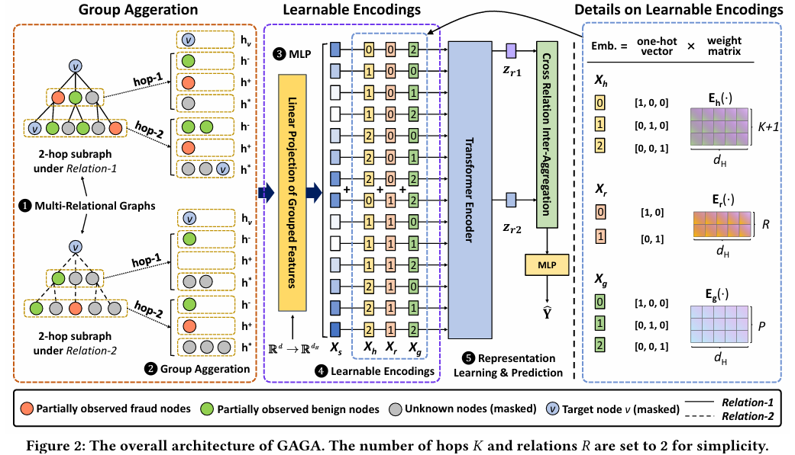

# NN Project — GAGA

Reviewed: No

# GAGA — Label Information Enhanced Fraud Detection against Low Homophily

<aside>
🎯

**What this paper is**

- GAGA (**G**roup **AG**gregation enhanced Tr**A**nsformer) is a fraud detector for multi-relational graphs built to work where standard GNNs fail: the **low homophily** regime, where a node and its neighbors mostly have *different* labels
- Its two core ideas are **group aggregation** (split neighbor pooling by class label instead of mixing everything into one vector) and **learnable encodings** fed to a Transformer.
- It reports up to **24.39%** improvement over prior fraud detectors on YelpChi, Amazon, and Baidu’s industrial BF10M dataset.
</aside>

# Background: The Problem Setup

## Low Homophily

<aside>
🐦

**Homophily = “birds of a feather”**

Homophily is the **degree to which connected nodes share the same label**. It is measured by the **edge homophily ratio** $h$: the fraction of edges whose two endpoints have the same class:

1. High homophily ($h \to 1$) is a citation graph (papers cite same-topic papers)
2. Low homophily / heterophily ($h \to 0$) means a node’s neighbors mostly belong to *other* classes

$$
h = \frac{\big|\{(u,v)\in E : y_u = y_v\}\big|}{|E|}
$$

</aside>

<aside>
⚠️

**Why low homophily breaks standard GNNs**

- Message-passing GNNs aggregate neighbors by averaging/smoothing labels of neighbors
- Under **heterophily**, this smoothing mixes in features from other classes and **dilutes the signal you’re trying to learn**
- In fraud detection fraudolent nodes camouflage by connecting to many benign nodes, so a fraud node’s neighborhood is mostly benign. Naive averaging buries the fraud signal in the benign majority — this is the failure GAGA is designed to fix.
</aside>

## Problem Formulation

<aside>
🧮

**Binary, semi-supervised, multi-relational**

- The graph $\mathcal{G}(V, E, X, Y)$ has:
    1. $N$ nodes 
    2. $R$ relations (one adjacency matrix per relation)
    3. $d$-dimensional node features
    4. **A small portion of labeled nodes** $\hat{V}$ (semi-supervised). Labels are binary, so the number of classes is fixed at **$C = 2$**.: 
        1. $y_v = 1$ is fraud
        2. $y_v = 0$ is benign
</aside>

## The Two Challenges

<aside>
🧱

**Challenge 1 — indiscriminate aggregation**

- Standard message passing assimilates the target node’s representation with its neighbors’ regardless of label
- Under low homophily this *hurts:* the fraud node gets averaged toward its benign neighbors. **Group aggregation** solves this.
</aside>

<aside>
🏷️

**Challenge 2 — labels underused**

- Most GNNs use labels only as a training supervision signal, never as input features
- GAGA instead injects partially observed labels into the feature space via the **group encoding**, so label information augments features at both training and inference time.
</aside>

# Architecture Overview

<aside>
🔭

**The five stages at a glance**

- 1️⃣-2️⃣ **Group Aggregation →** Precompute multi-hop neighbors per relation, pool them *per label group* into a flat sequence of group vectors — weight-free preprocessing done once
- 3️⃣ **Linear Projection →** lift each group vector to hidden dim $d_H$
- 4️⃣ **Learnable Encodings →** add hop / relation / group **encodings** so the Transformer knows where each vector came from
- 5️⃣ **Representation Learning & Prediction →** a vanilla **Transformer encoder** re-weights the sequence, then cross-relation inter-aggregation + an MLP head produce the fraud probability
</aside>

# Stage 1️⃣–2️⃣: Group Aggregation

## The Starting Point — Standard GNN Aggregation

<aside>
🔁

**A normal message-passing layer (GraphSAGE-style)**

- A standard GNN layer:
    1. **Pools all neighbors into a single mean**
    2. Applies a learnable transform $W_k$
    3. Adds the target node’s own transformed vector (self-term $B_k \vec{h}_v^k$)
    4. And passes through a nonlinearity $\sigma$
    
- It is **recursive** (layer $k$ feeds layer $k+1$) and **label-blind** (all neighbors collapse into one vector)

$$
\vec{h}_v^{k+1} = \sigma\!\left( W_k \sum_{u \in \mathcal{N}(v)} \frac{\vec{h}_u^k}{|\mathcal{N}(v)|} + B_k \vec{h}_v^k \right)
$$

</aside>

## Strip the Layer to Bare Aggregation

<aside>
✂️

**Throw away the learnable parts**

- GAGA discards $W_k$, $B_k$, $\sigma$, and the recursion
- What survives is just the **normalized sum**, now on **raw input features** $x_u$ instead of hidden states
- The self-loop $\cup\{v\}$ is the demoted self-term. This is the “indiscriminate” baseline the paper criticizes — one vector, all neighbors mixed.

$$
f_{agg}\!\left(\{x_u \mid u \in \mathcal{N}(v)\cup\{v\}\}\right) = \frac{1}{\phi(\cdot)} \sum_{u \in \mathcal{N}(v)\cup\{v\}} x_u \tag1
$$

</aside>

## One-Hop Group Aggregation

<aside>
🎨

**The one move that defines GAGA: partition the sum by label**

- Instead of one sum over the whole neighborhood, do $P$ sums: one per label group
- Neighbors with the same label go into the same group $V_i$, and each group is pooled separately
- With $C=2$ the groups are:
    1. $V^-$  → Benign
    2. $V^+$ → Fraud 
    3. $V^*$ → Masked/unknown
    
- The target node $v$ is masked into $V^*$ to prevent **label leakage**.
- We can perform the **per-group aggregation** and get a sequence of $P=3$ group vectors:

$$
H_g = [\,h_1, h_2, h^*\,] = [\,h^-,\ h^+,\ h^*\,]
$$

$$
h_i = f_{agg}\!\left(\{x_u \mid u \in V_i\}\right) = \frac{1}{\phi(\cdot)} \sum_{u \in V_i} x_u\tag2
$$

🟩 $H_g$ → Sequence of group vectors

🟦 $\phi(\cdot) = |V_i|^{\alpha}$ → Normalizer, with $\alpha=1$ from paper’s settings

</aside>

## Multi-Hop Group Aggregation

<aside>
🌐

**Generalize to K hops**

- Run the **one-hop aggregation independently on each hop’s neighborhood $\hat{\mathcal{N}}_k(v)$** and concatenate across hops
- After this step, per relation you have $P \times K$ group vectors (for Amazon: $3 \times 2 = 6$)

$$
 H_g^{(k)} = [\,h^-,\ h^+,\ h^*\,]^{(k)} \\[7pt]
H_r = \big\Vert_{k=1}^{K} H_g^{(k)}  \tag3 
$$

🟩 $H_r$ → Group aggregation results  within $𝐾$ hops under relation $r$

🟩$H_g^{(k)}$ → Group vector of the $k-$hop

</aside>

## Building the Input Sequence ($H_s$)

<aside>
🧵

**Prepend the self vector, then concat across relations**

- Bring back the target node’s own raw feature as a standalone vector $h_v$ (the true descendant of the GNN self-term — kept *separate*, not summed)
- Prepend it to each relation’s group vectors, then concatenate all relations into one flat sequence $H_s$ :

$$
H_{v,r} = [\,h_v\,] \,\Vert\, H_r, \qquad H_s = \big\Vert_{r=1}^{R} H_{v,r}
$$

🟩 $H_{v,r}$ → Input feature sequence

🟦 $S = R \times (P \times K + 1)$ → Total sequence length

</aside>

<aside>
🟩

**Sequence-length sanity check for the datasets:**

- **Amazon**: $R=3$, $K=2$, $P=3$ → $S = 3 \times (3{\times}2 + 1) = 21$ vectors
- **YelpChi**: same shape → $S = 21$ vectors
</aside>

# Stage 3️⃣: Linear Projection

<aside>
📐

**Lift each group vector to hidden dimension**

- Each of the $S$ group vectors in $H_s$ is **linearly embedded** from feature dim $d$ up to the Transformer hidden dim $d_H$, then passed through an activation $\sigma$
- This produces $X_s$, the **base sequence** the encodings get added onto

$$
X_s = \sigma\big(\psi(H_s)\big)
$$

🟦 $\psi : \mathbb{R}^{S \times d} \to \mathbb{R}^{S \times d_H}$ → Fully connected layer

</aside>

# Stage 4️⃣: Learnable Encodings

<aside>
📌

**Why encodings are needed**

- A Transformer treats its inputs as an **unordered set** — after flattening to $S$ vectors, it has no idea which vector is $1$-hop vs $2$-hop, which relation it came from, or which label group it represents. That information would be lost
- The fix (same idea as positional encoding in NLP): attach a small learnable “stamp” to each position
- GAGA uses three parallel stamps — hop, relation, group — each a learnable lookup table indexed by a one-hot vector:

$$
\text{embedding} = \text{one-hot} \times \text{weight matrix}
$$

</aside>

## Hop Encoding Sequence

<aside>
🏌🏼

**Encoding of the $k^{th}$ hop**

- Let us define the **Hop embedding table** as a learnable table $E_h() \sim (K{+}1,d_H)$: **each row in the table represent one different hop level**:
    1. Row $0$ = target
    2. Row $1$ = $1$-hop
    3. $\dots$ 
    4. Row $K$ = $K$-hop 
    
- The hop encoding sequence $X_h$ has exactly the same dimension as the input $X_s\sim(S,d_h)$
- **$E_h(\cdot)$** returns a **single vector** of length $d_H$, and the $S$ results are stacked to create a $S\times d_h$ matrix $X_h$
- Within one relation block, $E_h(1)$ repeats three times because the 1st hop produced three group vectors ($h^-, h^+, h^*$) and all three are “1-hop”
- The whole block then repeats for each relation

$$
\tag4 X_h=\big[\underbrace{\overbrace{E_h(0)}^{\text{target}},\overbrace{E_h(1),E_h(1),E_h(1)}^{\text{First hop}},\dots,\overbrace{E_h(k),E_h(k),E_h(k)}^{\text{K-th hop}}}_{\text{First relation}},\dots\\[7pt]
\dots\underbrace{E_h(0),E_h(1),E_h(1),E_h(1),\dots,E_h(k),E_h(k),E_h(k)\big]}_{\text{R-th relation}}
$$

Hop encoding with $K=2$

<aside>
🟩

**Fetching row $k$ is a one-hot lookup — Example**

For $K=2,$ let us consider $k=1$, the result is row 1 of the hop embedding table: 

$$
E_h(1) = [0,1,0]\, W
$$

</aside>

</aside>

## Relation Encoding

<aside>
🔗

**Encoding of the $r^{th}$ relation**

- Let us define the **relation embedding table** as a learnable table $E_r(\cdot)\sim (R, d_H)$
- Every vector belonging to relation $r$ gets the same stamp $E_r(r{-}1)$
- This lets the self-attention re-weight group vectors coming from different relations, since relations differ in usefulness and homophily

$$
\tag6 X_r = \Big[\ \underbrace{E_r(0), \dots, E_r(0)}_{\text{1st relation}},\ \underbrace{E_r(1), \dots, E_r(1)}_{\text{2nd relation}},\ \dots,\ \underbrace{E_r(R{-}1), \dots}_{R\text{-th relation}}\ \Big]
$$

Relation encoding with $R=2$

</aside>

## Group Encoding

<aside>
🏷️

**Encoding of the $g^{th}$ label — Label-injection trick**

- Let us define the **label embedding table** as a learnable table $E_g(\cdot)\sim(P,d_H)$
- Because group aggregation already partitioned neighbors by class, the group-embedding index *is* the class label:
    1. $E_g(-)$ → Benign
    2. $E_g(+)$ → Fraud
    3. $E_g(*)$ → Masked
    
- This is how GAGA puts **label information directly into the feature space** (solving Challenge 2). Note the target node’s own vector is stamped $E_g(*)$ to avoid label leakage.

Group encoding with $C=2$ classes

$$
\tag7 X_g = \Big[\ \underbrace{E_g(*),\ E_g(-), E_g(+), E_g(*),\ \dots,\ E_g(-), E_g(+), E_g(*)}_{\text{1st relation}},\ \dots\ \Big]
$$

</aside>

## Fusing the Encodings

<aside>
➕

**Add** $X_h$, $X_r$, $X_g$ 

- All encoding have the same length $S$ as $X_s$, so they are simply **summed** elementwise
- Each vector now carries its content *plus* a hop-flavor, relation-flavor, and label-flavor
- When attention compares two vectors it can tell whether they are same-hop / same-relation / same-group and weight them accordingly.

$$
X_{in} = X_s + X_h + X_r + X_g
$$

</aside>

# Stage 5️⃣ Transformer Encoder, Inter-Aggregation & Prediction

<aside>
🤖

**A vanilla Transformer — no GAGA-specific novelty here**

- The encoder is a standard **multi-head self-attention Transformer** (Vaswani et al.).
- It re-weights the $S$ vectors of $X_{in}$ via $M$ attention heads with learnable $Q, K, V$ projections, stacked over $L$ layers (Amazon $L=2$, YelpChi $L=3$)
    
    $$
    x_i^{l+1} = \text{Concat}(\text{head}_1, \dots, \text{head}_M)\, O^l
    $$
    

$$
\text{head}_m = \sum_{j \in S} w_{ij}\big(V^{m,l} x_j^l\big), \qquad w_{ij} = \text{softmax}_j\!\left(\frac{Q^{m,l} x_i^l \cdot K^{m,l} x_j^l}{\sqrt{d_H}}\right)
$$

</aside>

## Extract One Vector per Relation

<aside>
📖

**CLS-style readout**

- The encoder outputs a sequence $Z$ of the same length $S$
- GAGA does **not** pool all $S$ vectors, but it grabs only the **first vector of each relation block —** position 0 of each block, which corresponds to the prepended $h_v$
- After attention, that position has absorbed information from all surrounding group/hop vectors, acting like a BERT `[CLS]` summary token
- The indices in the flat sequence are $\{0, s, 2s, \dots, (R{-}1)s\}$ with $s = P \times K + 1$ (Amazon: positions $\{0, 7, 14\}$)

$$
\{\,z_r \mid \forall r \in R\,\}\ \text{at indices}\ \{0,\ s,\ 2s,\ \dots,\ (R{-}1)s\}
$$

🟦 $s = P \times K + 1$

</aside>

## Inter-Aggregation Across Relations

<aside>
🔗

**Fuse the relation views**

- The $R$ extracted vectors are combined into the final node representation $z_v$ via **concatenation** (the “Cross Relation Inter-Aggregation” box)
- This is where the separate relation views get stitched together, up to this point each relation block was processed independently.

$$
z_v = z_{r_1} \,\Vert\, z_{r_2} \,\Vert\, \cdots \,\Vert\, z_{r_R}
$$

</aside>

## Classification & Loss

<aside>
📊

**MLP head + sigmoid → fraud probability**

- A plain MLP turns $z_v$ into a scalar fraud probability via **sigmoid** (not softmax — it’s binary)
- The model is trained with:
    1. **binary cross-entropy summed only over labeled nodes** $\hat{V}$ (semi-supervised: unlabeled nodes contribute nothing)
    2. **L2 weight-decay** term ($\lambda = 0.0001$)

$$
\mathcal{L} = -\sum_{v \in \hat{V}} \big[\, y_v \log p_v + (1 - y_v)\log(1 - p_v) \,\big] + \lambda \lVert \theta \rVert_2^2\tag9
$$

🟦 $p_v = \text{sigmoid}\big(\text{MLP}(z_v)\big)$

</aside>